# YOGA POSE DETECTION

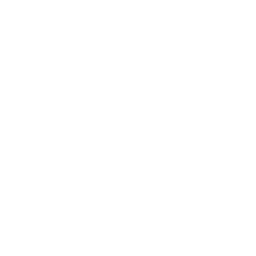

A project for Postgraduate course Artificial Intelligence with Deep Learning - 2023 Winter,
    authored by **Marc Fort, Francisco Dueñas and David Carballo**. Advised by **Pol Caselles**

<!-- TABLE OF CONTENTS -->
<details>
  <summary>Table of Contents</summary>
  <ol>
    <li>
      <a href="#about-the-project">About The Project</a>
    </li>
    <li>
      <a href="#dataset">Dataset</a>
      <ul>
        <li><a href="#original-dataset">Original Dataset</a></li>
        <li><a href="#transformed-dataset">Transformed Dataset</a></li>
        <li><a href="#angles-dataset">Angles Dataset</a></li>
      </ul>
    </li>
    <li>
      <a href="#arch-models">Architecture and Models</a>
      <ul>
        <li><a href="#openpose">OpenPose</a></li>
        <li><a href="#efficientnetb3">EfficientNetB3</a></li>
        <li><a href="#multilayer-perceptron">MultiLayer Perceptron</a></li>
        <li><a href="#combined-model">Combined Model</a></li>
      </ul>
    </li>
    <li>
      <a href="#how-to">How To</a>
      <ul>
        <li><a href="#how-to-download-dataset">How To Download Dataset</a></li>
        <li><a href="#how-to-extract-pose-keypoints">How To Extract Pose Keypoints</a></li>
        <li><a href="#mlp-model">MLP Model</a></li>
        <li><a href="#efficientnet-model">EfficientNet Model</a></li>
        <li><a href="#intermediate-feature-extraction">Intermediate Feature extraction</a></li>
        <li><a href="#final-classification-model">Final Classification Model</a></li>
      </ul>
    </li>
    <li>
        <a href="#experiments">Experiments</a>
        <ul>
        <li><a href="#angles">Angles</a></li>
        <li><a href="#efficientnet-vs-mobilenet">EfficientNet vs MobileNet</a></li>
        <li><a href="#efficientnet-overfitting">EfficientNet Overfitting</a></li>
      </ul>
    </li>
  </ol>
</details>

<!-- ABOUT THE PROJECT -->
## About The Project

This is a repository to introduce in Body Pose Detection, more specifically to detect Yoga Postures. The goal of this project is to learn how to manage a Deep Learning project and provide a solution that allows to improve existent solutions using [Yoga Postures Dataset](https://www.kaggle.com/datasets/tr1gg3rtrash/yoga-posture-dataset)

Goals:
* Achieve a different solution to the classification task
* Use pretrained models to generate data for later use
* Learn how to create a custom dataset that fits the needs of the project
* Create a "minimum viable product" that can be expanded upon in the future

___


<!-- DATASET -->
## Dataset

<p align="center">
    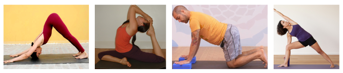
</p>

### Original Dataset
In this case, we have got the [Yoga Postures Dataset](https://www.kaggle.com/datasets/tr1gg3rtrash/yoga-posture-dataset) that consists in 2756 images distributed in 47 classes like as shown in the following figure:

<p align="center">
    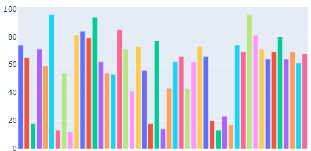
</p>


### Transformed Dataset

To fit images with our models, we have applied different transformations and data augmentation techniques.
* Resize tensor images to [255,255] and apply normalization with mean = [0.485, 0.456, 0.406] and std=[0.229, 0.224, 0.225]
* Data augmentation (Probability): HorizontalFlip(50%), GaussianBlur(50%), HueSaturationValue(50%) and ColorJitter(50%)

This dataset feeds the EfficientNet Model.

### Angles Dataset

To obtain the angles of the extracted poses from the original dataset, first, we have used a pretrained Open Pose model to extract all poses in a key points tensor. After that, we have applied an algorithm to compute the angles that forms each pose and its feed our Multilayer Perceptron model.


___

<!-- ARCHMODELS -->
## Architecture and Models

### OpenPose

OpenPose is a deep learning-based approach for estimating the 2D and 3D pose of a human body from a single image or video. OpenPose works by first detecting body parts such as the head, torso, arms, and legs using a convolutional neural network (CNN). It then associates the detected body parts into body joints and estimates the pose of the body.

The model is trained on large datasets of annotated images and videos, making it robust to different lighting conditions, camera angles, and body shapes. OpenPose can be used in a variety of applications such as motion tracking, augmented reality, human-computer interaction, and animation.

<p align="center">
  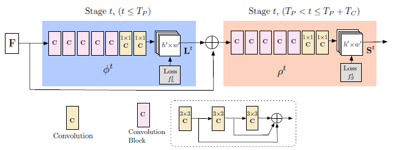
</p>

### EfficientNetB3

EfficientNet is a family of convolutional neural network models that were designed to achieve state-of-the-art accuracy while being computationally efficient.

EfficientNet models use a combination of scaling and compound scaling techniques to improve accuracy while reducing the number of parameters and computational cost. The basic idea is to increase the depth, width, and resolution of the model in a balanced way, which allows the model to learn more complex features and representations without requiring excessive resources. The models are pre-trained on large-scale image datasets such as ImageNet, which allows for transfer learning and fine-tuning on specific tasks with relatively small amounts of training data.

Architecture of EfficientNet           |  EfficientNet baseline network
:-------------------------:|:-------------------------:
  |  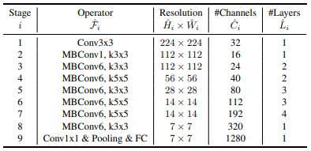

### MultiLayer Perceptron

A Multi-Layer Perceptron (MLP) is a type of neural network that consists of multiple layers of neurons, each layer connected to the next layer. In this case, the MLP takes 13 angles as input and classifies them into 47 yoga posture classes.

The input layer of the MLP receives the 13 angles as input and is connected to the first hidden layer. Batch Normalization is applied after the input layer to standardize the inputs, which makes the training process more stable and speeds up the convergence of the network.
Dropout is applied to randomly drop out some of the neurons during training to prevent overfitting. 

Each hidden layer consists of multiple neurons, and the activation function used in each of these layers is Rectified Linear Unit (ReLU). ReLU is a non-linear activation function that introduces non-linearity to the model and helps the model to learn complex representations.

Finally, the output layer of the MLP consists of 47 neurons, one for each yoga posture class.

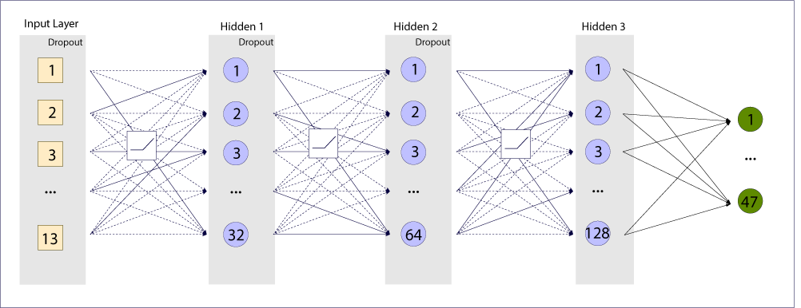

### Combined Model

A Combined MLP Model is a type of neural network that takes as input a 178 tensor generated by concatenating the output of two pre-existing models, the EfficientNet Model and the MLP Model. 

The EfficientNet Model is typically used for image classification, while the MLP Model is designed to classify data represented as a set of features or angles.

The model consists of one input layer and two hidden layers. Each hidden layer consists of multiple neurons, and the activation function used in these layers is the Rectified Linear Unit (ReLU) function.

After the final hidden layer, the output layer applies the Log Softmax activation function, which converts the output scores into probabilities. The probabilities indicate the likelihood of the input tensor belonging to each of the possible classes.

Overall, the Combined MLP Model takes advantage of the strengths of both the EfficientNet Model and the MLP Model, allowing for more accurate and robust classification of complex data.

<p align="center">
  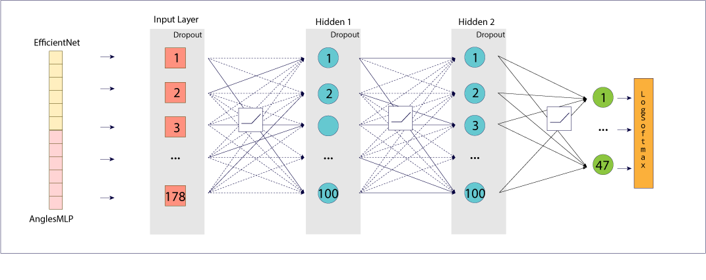
</p>

___

<!-- HOW TO -->
## How TO

All this project has been executed on Google Colab notebooks. In the next sections are provided the steps to obtain the results.

### How To Download Dataset
> Notice that it is required to create a Kaggle account in order to be able to download the dataset. 
#### &emsp;Option 1: Download from official web page
In order to download the Yoga Posture Dataset, go to its [Kaggle website page](https://www.kaggle.com/datasets/tr1gg3rtrash/yoga-posture-dataset), log in with your Kaggle account and then click on [download button](https://www.kaggle.com/datasets/tr1gg3rtrash/yoga-posture-dataset/download?datasetVersionNumber=1).

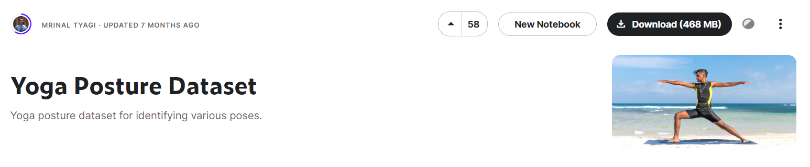

When you have downloaded the dataset, you must upload it in your Google Drive account to allow Colab notebooks access to it. 

#### &emsp;Option 2: Kaggle API Token
If you want load the dataset in your Google Colab, you must follow the instructions on first section of [Angles MLP Model notebook](AnglesMLP.ipynb).

In order to use the Kaggle’s public API, you must first authenticate using an API token. From the site header, click on your user profile picture, then on “My Account” from the dropdown menu. This will take you to your account settings at [Kaggle Account](https://www.kaggle.com/account). Scroll down to the section of the page labelled API:

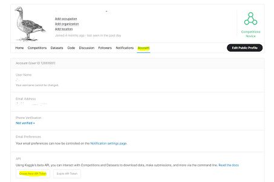

To create a new token, click on the “Create New API Token” button. This will download a fresh authentication token onto your machine.

After that, upload the authentication token in your Google Colab files and follow the steps to extract all the dataset in your Colab. 

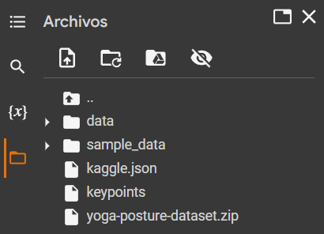 


### How To Extract Pose Keypoints [Optional]
To extract image poses from datasets, we will use [Angles MLP Model notebook](AnglesMLP.ipynb). In this Colab, we find the *Compute Keypoints* section, where our code runs through all the images extracting their poses.

First, you need to download and install the OpenPose Model from Github and then, the pretrained model extract a [1,18,3] keypoints tensor that represent a pose of a human detected in the image. 

```bash
# Simplified code of keypoints extraction
estimator = BodyPoseEstimator(pretrained=True)
keypoints = estimator(img)

# Output
[ 96  67   1]
[ 81  94   1]
[ 80  97   1]
[123 100   1]
[158  92   1]
[ 83  91   1]
[114 104   1]
[  0   0   0]
[120 149   1]
[156 100   1]
[212  96   1]
[120 144   1]
[144 106   1]
[  0   0   0]
[ 91  63   1]
[  0   0   0]
[ 78  67   1]
[  0   0   0]


```

As we can observe in the following image, each keypoint is a 2D coordinate on image.

<table>
   <tr>
      <td> ID </td>
      <td> Body Part </td>
      <td> ID </td>
      <td> Body Part </td>
      <td rowspan="11">
        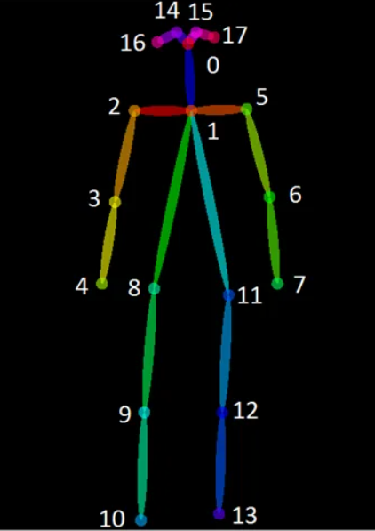
     </td>
   </tr>
   <tr>
      <td> 0 </td>
      <td> Head </td>
      <td> 9 </td>
      <td> Right Knee </td>
   </tr>
   <tr>
      <td> 1 </td>
      <td> Neck </td>
      <td> 10 </td>
      <td> Right Foot </td>
   </tr>
   <tr>
      <td> 2 </td>
      <td> Right Shoulder </td>
      <td> 11 </td>
      <td> Left Hip </td>
   </tr>
   <tr>
      <td> 3 </td>
      <td> Right Elbow </td>
      <td> 12 </td>
      <td> Left Knee </td>
   </tr>
   <tr>
      <td> 4 </td>
      <td> Right Hand </td>
      <td> 13 </td>
      <td> Left Foot </td>
   </tr>
   <tr>
      <td> 5 </td>
      <td> Left Shoulder </td>
      <td> 14 </td>
      <td> Right Eye </td>
   </tr>
   <tr>
      <td> 6 </td>
      <td> Left Elbow </td>
      <td> 15 </td>
      <td> Left Eye </td>
   </tr>
   <tr>
      <td> 7 </td>
      <td> Left Hand </td>
      <td> 16 </td>
      <td> Right Ear </td>
   </tr>
   <tr>
      <td> 8 </td>
      <td> Right Hip </td>
      <td> 17 </td>
      <td> Right Ear </td>
   </tr>
</table>


> For the following sections it is necessary that you are using the [YogaPostureCV notebook](YogaPostureCV.ipynb)

### MLP Model

To be able to run the model, first, we need to load the keypoints from the file [keypoints.csv](keypoints.csv) obtained from the instructions in the previous section.

```
load_keypoints = torch.load('keypoints')
```

After that, we can run all the cells to define the function that calculates the angles, the creation of the dataset, the creation of the MLP, and the functions train, validation and test.

### EfficientNet Model
In order to be able to run the EfficientNet model we first need to import the model from Torchvision. For this project, we use the EfficientNetB3 model with pretrained weights from ImageNet.

Next, we need to modify the final Sequential of the model so it is suited to our classification task with 47 classes, instead of the bigger number of classes in ImageNet.
```
img_model = torchvision.models.efficientnet_b3(weights='DEFAULT')
#Substitution of the model's classifier so it predicts between the 47 classes of the Dataset instead of the 1000 of Imagenet, along with other changes to combat Overfitting
img_model.classifier = nn.Sequential(
    nn.BatchNorm1d(1536, eps=1e-05, momentum=0.1, affine=True, track_running_stats=True),
    nn.Linear(in_features=1536, out_features=50, bias=True),
    nn.Dropout(p=0.5, inplace=True),
    nn.Linear(in_features=50, out_features=47, bias=True),
    nn.LogSoftmax(dim = -1) 
```

### Intermediate Feature extraction
In order to obtain the features obtained by the model we need to take their output before the final Linear layer. To do this, we will cut the models after the penultimate Linear layer. We will also save a state_dict of both models before cutting so we can restore the parameters to their values post-training. After the slicing of the models, we have a loading state_dict cell.

Important: **Do not run the slicing cell more than once or the rest of the notebook will not work**

```
torch.save(img_model.state_dict(), '/content/img_model_state_dict')
torch.save(mlp.state_dict(), '/content/angle_mlp_state_dict')
```
```
###WARNING: DO NOT RUN THIS CELL MORE THAN ONCE OR THE REST OF THE NOTEBOOK WILL NOT WORK
img_model.classifier = img_model.classifier[:-3]
mlp = nn.Sequential(*(list(mlp.children())[:-2]))

mlp.to(device)
img_model.to(device)
```
```
img_model.load_state_dict(torch.load('/content/img_model_state_dict'), strict = False)
mlp.load_state_dict(torch.load('/content/angle_mlp_state_dict'), strict = False)
```

### Final Classification Model
For the final classification model, we will need a model that takes a concatenation of the previous 2 models' extracted features and processes them to generate a prediction. In order to do this, we will need an input size that is the sum of the lengths of both outputs, and an output size that is equal to the number of classes. If we want this model to work correctly, we need to make sure the input given to the 2 previous models is the same.
```
class CombinedMLP(nn.Module):
  def __init__(self, input_size, hidden_size, output_size):
    super(CombinedMLP, self).__init__()
    self.fc1 = nn.Linear(input_size, hidden_size)
    self.relu = nn.ReLU()
    self.batch = nn.BatchNorm1d(hidden_size)
    self.drop1 = nn.Dropout(0.4)
    self.fc2 = nn.Linear(hidden_size, hidden_size)
    self.drop2 = nn.Dropout(0.4)
    self.fc3 = nn.Linear(hidden_size, output_size)
    self.logsoftmax = nn.LogSoftmax(dim = -1)

  def forward(self, x):
    out = self.fc1(x)
    out = self.relu(out)
    out = self.batch(out)
    out = self.drop1(out)
    out = self.fc2(out)
    out = self.relu(out)
    out = self.drop2(out)
    out = self.fc3(out)
    out = self.logsoftmax(out)

    return out
```

<!-- EXPERIMENTS -->
## Experiments
### Angles

To test and improve our AngleMLP model, we have done different experiments from changing the way of obtaining the angles to applying Data Augmentation techniques. 

#### Get Angles From Previous Keypoint

One of the first approaches we used to calculate angles from the extracted keypoints was to calculate the angle of each keypoint with respect to the previous keypoint. That is, as each connection consists of two points A and B, we placed the center of coordinates at point A and calculated the angle of the vector formed by AB.

However, we realized that this approach did not adequately represent the yoga pose because we could obtain similar representations for completely different poses.

<p align="center">
  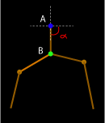
</p>


#### Get Angles From Reference Vector

The next approach we tested was to calculate the angles formed by each connection with a reference vector connecting the neck key point to the hip center. This improved the difference between poses a bit, but we still had problems, for example, in a posture where the person was standing or lying down.

<p align="center">
  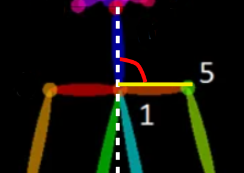
</p>

#### Get Angles From Previous Vector

Therefore, we used an approach similar to those used in robotics to calculate the movement of joints in a chain kinematics. This allowed us to represent the angle of a joint as a reference to the previous joints, giving us a more accurate representation of each pose. To do this, we first calculated an initial vector that served as a reference to determine if the pose was standing or lying down, and then we traversed the joints of the whole body, calculating the angle that they formed.

<p align="center">
  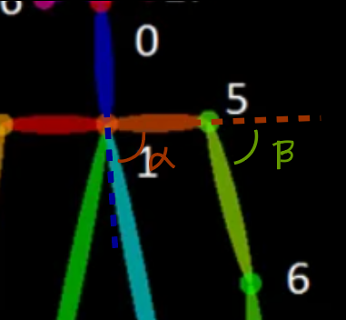
</p>

#### Angles Overfitting

As we had images where OpenPose had not correctly extracted the poses, which resulted in poses with very few or non-existent key points, and we also had a dataset with some classes with few images, this caused overfitting to occur when training our angle model.

#### Hypothesis

To solve this problem, we believed that applying Data Augmentation by adding some noise to the angles and removing those poses and classes that did not provide enough data would result in a model that would better generalize to unseen angles.

#### Setup

To apply noise by adding an alpha value to the angle tensor with a probability of 75%.
```
if prob < 0.75:
        n = random.uniform(-alpha,alpha) * math.pi / 180
        angles = angles + n
```
With this solution, our model increased its accuracy by around 5%, while also reducing overfitting to some extent.

To eliminate angles and classes that do not provide sufficient information:
```
for i in range(0,len(angles)): 
        if torch.count_nonzero(angles[i]) > 0:
        new_angles.append(angles[i])
        new_labels.append(self.labels[i])
```

But in this case, we saw that overfitting was still appearing and the model was not improving much, so we decided not to use this option.

#### Results

Training Accuracy: 82,698%

Test Accuracy: 42,02%

Plot of train and val accuracy during training:

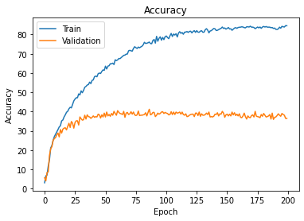

#### Conclusions

As we have seen, increasing some noise did improve the model, but having such a limited dataset and not having extracted all the poses with their necessary key points, we have a model that does not work properly.

### EfficientNet vs MobileNet
Initially, MobileNetV3_Small was the chosen model for the image processing section of this project due to it's lightweight design, however, while exploring other notebooks uploaded to Kaggle using the same dataset, we discovered that we could get a similar performance with less training epochs (and time).

#### Hypothesis
By running the same training loop and the same data through both models with the same classifier architecture, we can get the same accuracy in test with less training epochs.

#### Setup
MobilenetV3_Small: Default architecture except classifier, ImageNet pretrained weights.

EfficientNetB3: Default architecture except classifier, ImageNet pretrained weights.

Classifier architecture:
```
(classifier): Sequential(
    (0): Linear(in_features=1536, out_features=50, bias=True)
    (1): Linear(in_features=50, out_features=47, bias=True)
    (2): LogSoftmax(dim=-1)
```

Criterion and Optimizer:
```
criterion = nn.NLLLoss()
optimizer = optim.AdamW(model.parameters(), lr = 1e-4, weight_decay = 0.01)
```


#### Results
MobilenetV3_Small:

Test Acc: 68.372

Epochs: 10

EfficientNetB3:

Test Acc: 70.510

Epochs: 6

#### Conclusions
We can reduce the number training epochs and, since every epoch takes a similar amount of time on both models, the time it takes to train the model to achieve a given test score.

### EfficientNet Overfitting
Initially, the EfficientNet model was experiencing big overfitting, with differences between train accuracy and val/test accuracy of around 20 percentage points, with test accuracy maxing out at around 73% after 12 Epochs of training even with Data Augmentation already applied.

#### Hypothesis
By applying techniques that help with overfitting, such as Dropout, Weight Decay, and modifying the Hidden layer Size, amongst others, we can increase test accuracy.

#### Setup
EfficientNetB3: Default architecture except classifier, ImageNet pretrained weights.

Classifier architecture:
```
nn.Sequential(
    nn.BatchNorm1d(1536, eps=1e-05, momentum=0.1, affine=True, track_running_stats=True),
    nn.Linear(in_features=1536, out_features=50, bias=True),
    nn.Dropout(p=0.5, inplace=True),
    nn.Linear(in_features=50, out_features=47, bias=True),
    nn.LogSoftmax(dim = -1)
)
```

Criterion, Optimizer and Scheduler:
```
criterion = nn.NLLLoss()
optimizer = optim.AdamW(
    [
        {"params": img_model.features.parameters(), "lr": 1e-5},
        {"params": img_model.classifier.parameters(), "lr": 1e-4},
    ],weight_decay = 0.01)
scheduler = optim.lr_scheduler.StepLR(optimizer, step_size=5, gamma=0.5)
```
Epochs = 12

#### Results
Training Accuracy after training: 98.004
Test Accuracy after training: 76.449

Plot of train and val accuracy during training:

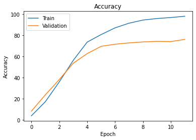

#### Conclusions
By applying Batch Normalization, Dropout, weight_decay and a learning rate scheduler, we managed to increase the test accuracy slightly. However, the improvement was not very big and the difference between Training and Test accuracy was quite big, meaning that there was still overfitting. Given that data augmentation was already applied, the best ideal solution would be to obtain a larger amount of images to train the model with.

### Combined MLP
The original and main goal of this project was to take an image-based approach to the classification task for this dataset, and combine it with pose information to hopefully improve the performance. 

To achieve this, we took the previously explained models and used their outputs as input for a final MLP that goes on to make the final classification.

#### Hypothesis
By training the EfficientNet and the AnglesMLP models separately, taking the features (before predictions) that these models output and then combining them to feed them into another MLP model, we can improve the test accuracy compared to the EfficientNet predictions.

#### Setup
Dataset:
```
class CombinedDataset(Dataset):
    def __init__(self, dataset1, dataset2):
        self.d1 = dataset1
        self.d2 = dataset2
    
    def __getitem__(self, index):
        img, label1 = self.d1.__getitem__(index)
        angle, label2 = self.d2.__getitem__(index)

        if label1 != label2:
            print("[ERROR] Different labels with same index") 
        
        return img, angle, label1

    def __len__(self):
        if self.d1.__len__() != self.d2.__len__():
            print("[ERROR] Different size of datasets") 
        return len(self.d1)
```

CombinedMLP model:
```
class CombinedMLP(nn.Module):
  def __init__(self, input_size, hidden_size, output_size):
    super(CombinedMLP, self).__init__()
    self.fc1 = nn.Linear(input_size, hidden_size)
    self.relu = nn.ReLU()
    self.batch = nn.BatchNorm1d(hidden_size)
    self.drop1 = nn.Dropout(0.4)
    self.fc2 = nn.Linear(hidden_size, hidden_size)
    self.drop2 = nn.Dropout(0.4)
    self.fc3 = nn.Linear(hidden_size, output_size)
    self.logsoftmax = nn.LogSoftmax(dim = -1)

  def forward(self, x):
    out = self.fc1(x)
    out = self.relu(out)
    out = self.batch(out)
    out = self.drop1(out)
    out = self.fc2(out)
    out = self.relu(out)
    out = self.drop2(out)
    out = self.fc3(out)
    out = self.logsoftmax(out)

    return out
```
```
combined_mlp = CombinedMLP(input_size = 178, hidden_size = 100, output_size = num_classes)
combined_mlp.to(device)
```

Criterion and Optimizer:
```
criterion = nn.NLLLoss()
optimizer = optim.AdamW(
    [
        {"params": img_model.features.parameters(), "lr": 1e-5},
        {"params": img_model.classifier.parameters(), "lr": 1e-4},
        {"params": mlp.parameters(), "lr": 1e-3},
        {"params": combined_mlp.parameters(), "lr": hparams['learning_rate']}
    ],weight_decay = 1e-6)
```

Train loop:
```
def combined_train(model, optimizer, criterion, train_loader, val_loader, num_epochs):
    for epoch in range(num_epochs):
        model.train()  # set the model to training mode
        img_model.train()
        mlp.train()
        train_loss = 0.0
        train_total = 0
        train_correct = 0

        # iterate over the train_loader to get the model outputs and labels
        for batch_idx, (images, angles, labels) in enumerate(train_loader):
            images = images.to(device)
            angles = angles.to(device)
            labels = labels.to(device)
            img_output = img_model(images)
            mlp_output = mlp(angles)
            combined_output = torch.cat((img_output, mlp_output), dim=1)

            # feed the combined output to the model and compute the loss
            optimizer.zero_grad()
            logits = model(combined_output)
            loss = criterion(logits, labels)

            # compute gradients and update parameters
            loss.backward()
            optimizer.step()

            # accumulate the training loss and accuracy
            train_loss += loss.item()
            _, predicted = torch.max(logits.data, 1)
            train_total += labels.size(0)
            train_correct += (predicted == labels).sum().item()

        # compute the average training loss and accuracy for the epoch
        train_loss /= len(train_loader)
        train_accuracy = 100 * train_correct / train_total
        print("Epoch {} - Training loss: {:.6f}, Training accuracy: {:.2f}%".format(epoch+1, train_loss, train_accuracy))

        # validate the model on the validation set
        val_loss, val_accuracy = combined_validate(model, criterion, val_loader)
        print("Epoch {} - Validation loss: {:.6f}, Validation accuracy: {:.2f}%".format(epoch+1, val_loss, val_accuracy))
```

Validate loop:
```
def combined_validate(model, criterion, val_loader):
    model.eval()  # set the model to evaluation mode
    img_model.eval()
    mlp.eval()
    val_loss = 0.0
    val_acc = 0.0

    # disable gradient computation for validation
    with torch.no_grad():
        # iterate over the validation set to get the model outputs and labels
        for batch_idx, (images, angles, labels) in enumerate(val_loader):
            images = images.to(device)
            angles = angles.to(device)
            labels = labels.to(device)
            img_output = img_model(images)
            mlp_output = mlp(angles)
            combined_output = torch.cat((img_output, mlp_output), dim=1)

            # feed the combined output to the model and compute the loss
            logits = model(combined_output)
            loss = criterion(logits, labels)

            # accumulate the validation loss
            val_loss += loss.item()

            # compute the validation accuracy
            preds = torch.argmax(logits, dim=1)
            val_acc += torch.sum(preds == labels).item()

    # compute the average validation loss and accuracy
    val_loss /= len(val_loader)
    val_acc = (val_acc / len(val_loader.dataset)) * 100  # convert to percentage

    return val_loss, val_acc
```

Test loop (with extra metrics):
```
def combined_test(model, criterion, test_loader):
    model.eval()  # set the model to evaluation mode
    img_model.eval()
    mlp.eval()
    test_loss = 0.0
    test_acc = 0.0
    preds_list = []
    labels_list = []

    # disable gradient computation for testing
    with torch.no_grad():
        # iterate over the test set to get the model outputs and labels
        for batch_idx, (images, angles, labels) in enumerate(test_loader):
            images = images.to(device)
            angles = angles.to(device)
            labels = labels.to(device)
            img_output = img_model(images)
            mlp_output = mlp(angles)
            combined_output = torch.cat((img_output, mlp_output), dim=1)

            # feed the combined output to the model and compute the loss
            logits = model(combined_output)
            loss = criterion(logits, labels)

            # accumulate the test loss
            test_loss += loss.item()

            # compute the test accuracy
            preds = torch.argmax(logits, dim=1)
            preds_list.append(preds.cpu())
            labels_list.append(labels.cpu())
            test_acc += torch.sum(preds == labels).item()

    preds = torch.cat(preds_list, dim=0)
    labels = torch.cat(labels_list, dim=0)
    cf_matrix = confusion_matrix(labels, preds)
    df_cm = pd.DataFrame(cf_matrix / np.sum(cf_matrix, axis=1)[:, None], index=[i for i in classes],
                         columns=[i for i in classes])
    plt.figure(figsize=(32, 21))
    sn.heatmap(df_cm, annot=True, cmap="Blues", square=True, fmt='.2f', xticklabels=sorted(list(poses_dict.keys())), yticklabels=sorted(list(poses_dict.keys())),
                cbar=False)
    report = classification_report(labels.cpu(), preds.cpu(), target_names=sorted(list(poses_dict.keys())))
    print(report)

    # compute the average test loss and accuracy
    test_loss /= len(test_loader)
    test_acc = (test_acc / len(test_loader.dataset)) * 100  # convert to percentage

    return test_loss, test_acc
```

#### Results
After 30 epochs of training:

Train accuracy: 84.82%
Val accuracy: 74.23%
**Test accuracy: 76.81%**
These results can vary by about 0-2% depending on the exact run

#### Conclusions
The performance increase (outside of training accuracy) stalls at around Epoch 21, with only very slightly higher values to using only the EfficientNet model. Having seen the low test performance from the AnglesMLP model, and high overfitting on both models, we can draw two main conclussions:

1. An increase in the performance of the AnglesMLP could potentially mean an improvement in the test performance of the CombinedMLP model.

2. The low amount of images provided by the dataset has shown to be a big obstacle through all the different stages of this project, to the point that, even with    techniques aimed at reducing overfitting, we could only slightly mitigate the problem.

<!-- Metrics -->
## Metrics
In this section we include some additional metrics that have not been shown throughout the other sections.

### CombinedMLP Heatmap
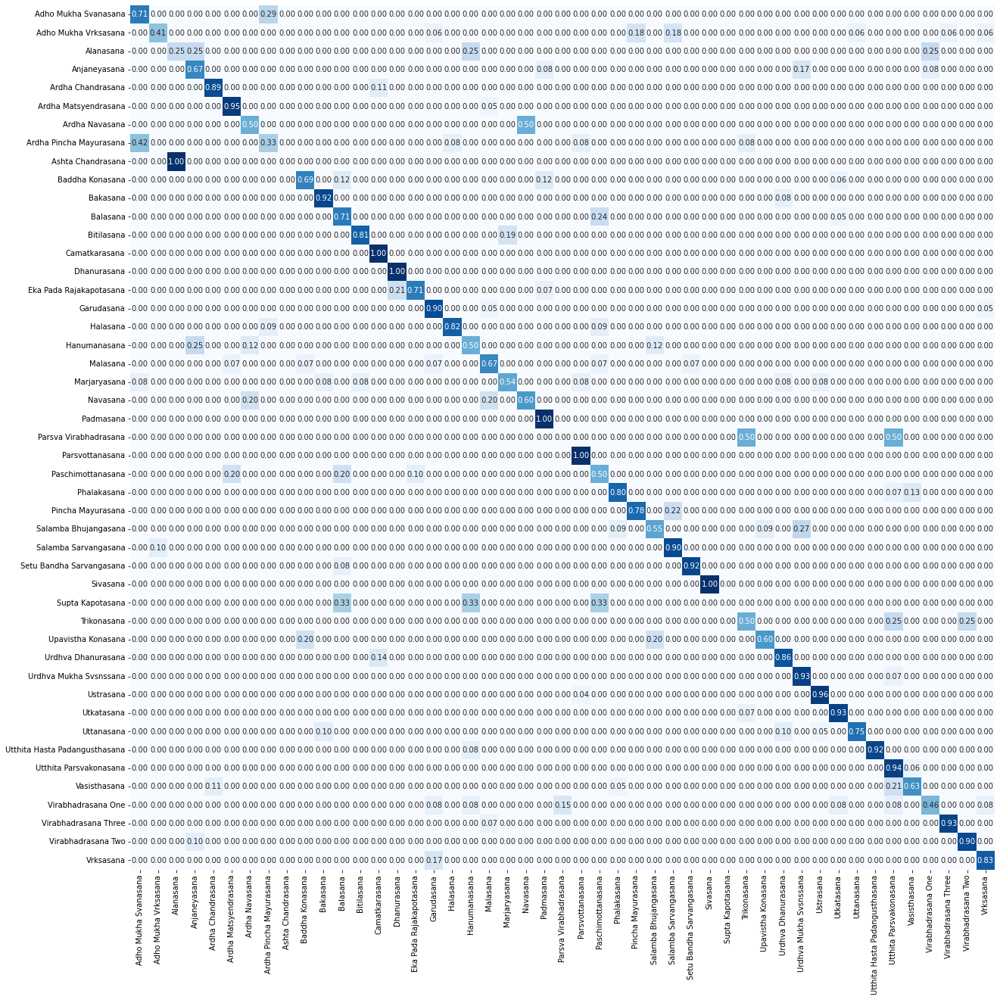

### Precision by class comparison between models
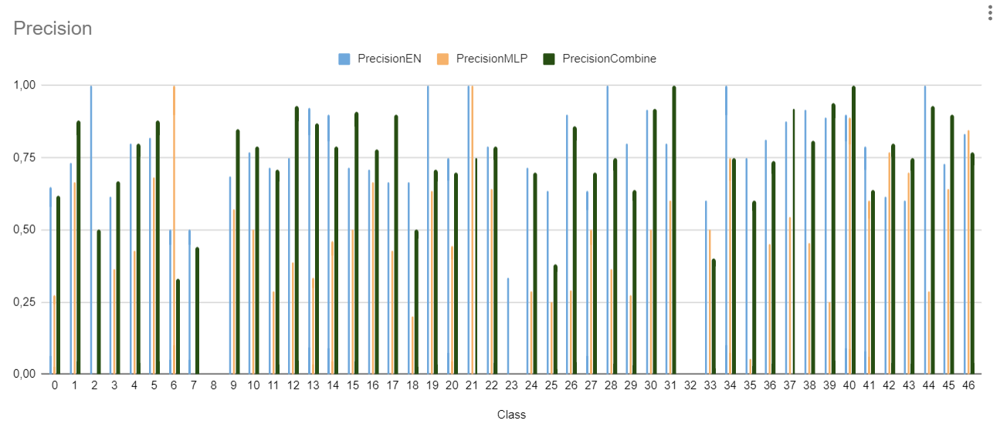

### Recall by class comparison between models
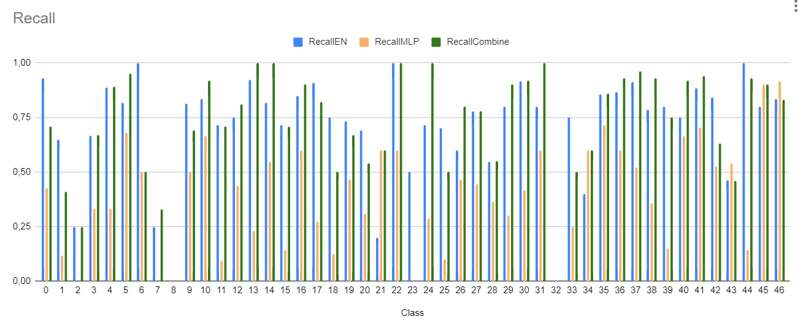

<p align="right">(<a href="#yoga-pose-detection">back to top</a>)</p>
