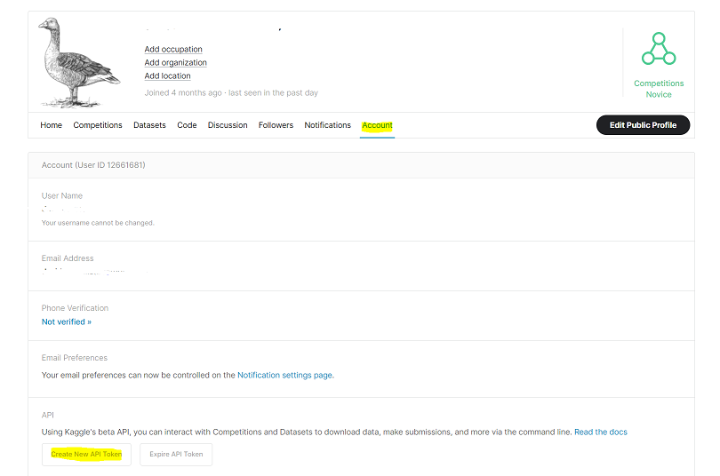

# YOGA POSE DETECTION


A project for Postgraduate course Artificial Intelligence with Deep Learning - 2023 Winter,
    authored by **Marc Fort, Francisco Dueñas and David Carballo**. Advised by **Pol Caselles**

<!-- TABLE OF CONTENTS -->
<details>
  <summary>Table of Contents</summary>
  <ol>
    <li>
      <a href="#about-the-project">About The Project</a>
    </li>
    <li>
      <a href="#dataset">Dataset</a>
      <ul>
        <li><a href="#original-dataset">Original Dataset</a></li>
        <li><a href="#project-dataset">Project Dataset</a></li>
      </ul>
    </li>
    <li>
      <a href="#arch-models">Architecture and Models</a>
      <ul>
        <li><a href="#openpose">OpenPose</a></li>
        <li><a href="#mobilenet">MobileNet</a></li>
        <li><a href="#mlp">MLP</a></li>
        <li><a href="#raw">Raw Data</a></li>
      </ul>
    </li>
    <li><a href="#how-to">How To</a></li>
    <li><a href="#experiments">Experiments</a></li>
  </ol>
</details>

<!-- ABOUT THE PROJECT -->
## About The Project

This is a repository to introduce in Body Pose Detection, more specifically to detect Yoga Postures. The goal of this project is to learn how to manage a Deep Learning project and provide a solution that allows to improve existent solutions. using [Yoga Postures Dataset](https://www.kaggle.com/datasets/tr1gg3rtrash/yoga-posture-dataset)

Goals:
* Achieve a different solution to the classification task
* Use pretrained models to generate data for later use
* Learn how to create a custom dataset that fits the needs of the project
* Create a "minimum viable product" that can be expanded upon in the future

___


<!-- DATASET -->
## Dataset

<p align="center">
    
</p>

### Original Dataset
In this case, we have got the [Yoga Postures Dataset](https://www.kaggle.com/datasets/tr1gg3rtrash/yoga-posture-dataset) that consists in 2756 images distributed in 47 classes like as shown in the following figure:

<p align="center">
    
</p>


### Transformed Dataset

To fit images with our models, we have applied different transformations and data augmentation techniques.
* Resize tensor images to [255,255] and apply normalization with mean = [0.485, 0.456, 0.406] and std=[0.229, 0.224, 0.225]
* Data augmentation (Probability): HorizontalFlip(50%), GaussianBlur(50%), HueSaturationValue(50%) and ColorJitter(50%)

This dataset feed the EfficientNet Model.

### Angles Dataset

To obtain the angles of the extracted poses from the original dataset, first, we have used a pretrained Open Pose model to extract all poses in a key points tensor. After that, we have applied an algorithm to compute the angles that forms each pose and its feed our Multilayer Perceptron model.


___

<!-- ARCHMODELS -->
## Architecture and Models
### OpenPose

### EfficientNet

Architecture of EfficientNet           |  EfficientNet baseline network
:-------------------------:|:-------------------------:
  |  

### MultiLayer Perceptron (MLP)


### RawData Model

### Final Classification Model


___

<!-- HOW TO -->
## How TO

All this project has been executed on Google Colab notebooks. In the next sections are provided the steps to obtain the results.

### How To Download Dataset
> Notice that it is required to create a Kaggle account in order to be able to download the dataset. 
#### &emsp;Option 1: Download from official web page
In order to download the Yoga Posture Dataset, go to its [Kaggle website page](https://www.kaggle.com/datasets/tr1gg3rtrash/yoga-posture-dataset), log in with your Kaggle account and then click on [download button](https://www.kaggle.com/datasets/tr1gg3rtrash/yoga-posture-dataset/download?datasetVersionNumber=1).


When you have downloaded the dataset, you must upload it in your Google Drive account to allow Colab notebooks access to it. 

#### &emsp;Option 2: Kaggle API Token
If you want load the dataset in your Google Colab, you must follow the instructions on first section of [Angles MLP Model notebook](AnglesMLP.ipynb).

In order to use the Kaggle’s public API, you must first authenticate using an API token. From the site header, click on your user profile picture, then on “My Account” from the dropdown menu. This will take you to your account settings at [Kaggle Account](https://www.kaggle.com/account). Scroll down to the section of the page labelled API:



To create a new token, click on the “Create New API Token” button. This will download a fresh authentication token onto your machine.

After that, upload the authentication token in your Google Colab files and follow the steps to extract all the dataset in your Colab. 

 


### How To Extract Pose Keypoints
To extract image poses from datasets, we will use [Angles MLP Model notebook](AnglesMLP.ipynb). In this Colab, we find the *Compute Keypoints* section, where our code runs through all the images extracting their poses.

First, you need download and install the OpenPose Model from Github and then, the pretrained model extract a [1,18,3] keypoints tensor that represent a pose of a human detected in the image. 

```bash
# Simplified code of keypoints extraction
estimator = BodyPoseEstimator(pretrained=True)
keypoints = estimator(img)

# Output
[ 96  67   1]
[ 81  94   1]
[ 80  97   1]
[123 100   1]
[158  92   1]
[ 83  91   1]
[114 104   1]
[  0   0   0]
[120 149   1]
[156 100   1]
[212  96   1]
[120 144   1]
[144 106   1]
[  0   0   0]
[ 91  63   1]
[  0   0   0]
[ 78  67   1]
[  0   0   0]


```

How we can observe in the following image, each keypoint is a 2D coordinate on image.

<table>
   <tr>
      <td> ID </td>
      <td> Body Part </td>
      <td> ID </td>
      <td> Body Part </td>
      <td rowspan="11">
        
     </td>
   </tr>
   <tr>
      <td> 0 </td>
      <td> Head </td>
      <td> 9 </td>
      <td> Right Knee </td>
   </tr>
   <tr>
      <td> 1 </td>
      <td> Neck </td>
      <td> 10 </td>
      <td> Right Foot </td>
   </tr>
   <tr>
      <td> 2 </td>
      <td> Right Shoulder </td>
      <td> 11 </td>
      <td> Left Hip </td>
   </tr>
   <tr>
      <td> 3 </td>
      <td> Right Elbow </td>
      <td> 12 </td>
      <td> Left Knee </td>
   </tr>
   <tr>
      <td> 4 </td>
      <td> Right Hand </td>
      <td> 13 </td>
      <td> Left Foot </td>
   </tr>
   <tr>
      <td> 5 </td>
      <td> Left Shoulder </td>
      <td> 14 </td>
      <td> Right Eye </td>
   </tr>
   <tr>
      <td> 6 </td>
      <td> Left Elbow </td>
      <td> 15 </td>
      <td> Left Eye </td>
   </tr>
   <tr>
      <td> 7 </td>
      <td> Left Hand </td>
      <td> 16 </td>
      <td> Right Ear </td>
   </tr>
   <tr>
      <td> 8 </td>
      <td> Right Hip </td>
      <td> 17 </td>
      <td> Right Ear </td>
   </tr>
</table>

### MLP Model


### EfficientNet Model

### Final Classification Model

<!-- EXPERIMENTS -->
## Experiments
### Angles
#### Get Angles From Previous Connection
#### Get Angles From Reference Vector
#### Get Angles From Previous Vector
#### Metrics
### EfficientNet vs MobileNet
#### Metrics
### Experiment3

<p align="right">(<a href="#yoga-pose-detection">back to top</a>)</p>
