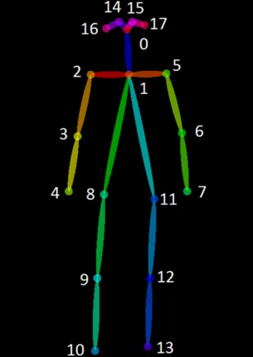

# YOGA POSE DETECTION


A project for Postgraduate course Artificial Intelligence with Deep Learning - 2023 Winter,
    authored by **Marc Fort, Francisco Dueñas and David Carballo**. Advised by **Pol Caselles**

<!-- TABLE OF CONTENTS -->
<details>
  <summary>Table of Contents</summary>
  <ol>
    <li>
      <a href="#about-the-project">About The Project</a>
    </li>
    <li>
      <a href="#dataset">Dataset</a>
      <ul>
        <li><a href="#original-dataset">Original Dataset</a></li>
        <li><a href="#project-dataset">Project Dataset</a></li>
      </ul>
    </li>
    <li>
      <a href="#arch-models">Architecture and Models</a>
      <ul>
        <li><a href="#openpose">OpenPose</a></li>
        <li><a href="#mobilenet">MobileNet</a></li>
        <li><a href="#mlp">MLP</a></li>
        <li><a href="#raw">Raw Data</a></li>
      </ul>
    </li>
    <li><a href="#how-to">How To</a></li>
    <li><a href="#experiments">Experiments</a></li>
  </ol>
</details>

<!-- ABOUT THE PROJECT -->
## About The Project

This is a repository to introduce in Body Pose Detection, more specifically to detect Yoga Postures. The goal of this project is to learn how to manage a Deep Learning project and provide a solution that allows to improve existent solutions using [Yoga Postures Dataset](https://www.kaggle.com/datasets/tr1gg3rtrash/yoga-posture-dataset)

Goals:
* Achieve a different solution to the classification task
* Use pretrained models to generate data for later use
* Learn how to create a custom dataset that fits the needs of the project
* Create a "minimum viable product" that can be expanded upon in the future

___


<!-- DATASET -->
## Dataset

<p align="center">
    
</p>

### Original Dataset
In this case, we have got the [Yoga Postures Dataset](https://www.kaggle.com/datasets/tr1gg3rtrash/yoga-posture-dataset) that consists in 2756 images distributed in 47 classes like as shown in the following figure:

<p align="center">
    
</p>


### Transformed Dataset

To fit images with our models, we have applied different transformations and data augmentation techniques.
* Resize tensor images to [255,255] and apply normalization with mean = [0.485, 0.456, 0.406] and std=[0.229, 0.224, 0.225]
* Data augmentation (Probability): HorizontalFlip(50%), GaussianBlur(50%), HueSaturationValue(50%) and ColorJitter(50%)

This dataset feeds the EfficientNet Model.

### Angles Dataset

To obtain the angles of the extracted poses from the original dataset, first, we have used a pretrained Open Pose model to extract all poses in a key points tensor. After that, we have applied an algorithm to compute the angles that forms each pose and its feed our Multilayer Perceptron model.


___

<!-- ARCHMODELS -->
## Architecture and Models

### OpenPose

OpenPose is a deep learning-based approach for estimating the 2D and 3D pose of a human body from a single image or video. OpenPose works by first detecting body parts such as the head, torso, arms, and legs using a convolutional neural network (CNN). It then associates the detected body parts into body joints and estimates the pose of the body.

The model is trained on large datasets of annotated images and videos, making it robust to different lighting conditions, camera angles, and body shapes. OpenPose can be used in a variety of applications such as motion tracking, augmented reality, human-computer interaction, and animation.

<p align="center">
  
</p>

### EfficientNetB3

EfficientNet is a family of convolutional neural network models that were designed to achieve state-of-the-art accuracy while being computationally efficient.

EfficientNet models use a combination of scaling and compound scaling techniques to improve accuracy while reducing the number of parameters and computational cost. The basic idea is to increase the depth, width, and resolution of the model in a balanced way, which allows the model to learn more complex features and representations without requiring excessive resources. The models are pre-trained on large-scale image datasets such as ImageNet, which allows for transfer learning and fine-tuning on specific tasks with relatively small amounts of training data.

Architecture of EfficientNet           |  EfficientNet baseline network
:-------------------------:|:-------------------------:
  |  

### MultiLayer Perceptron

A Multi-Layer Perceptron (MLP) is a type of neural network that consists of multiple layers of neurons, each layer connected to the next layer. In this case, the MLP takes 13 angles as input and classifies them into 47 yoga posture classes.

The input layer of the MLP receives the 13 angles as input and is connected to the first hidden layer. Batch Normalization is applied after the input layer to standardize the inputs, which makes the training process more stable and speeds up the convergence of the network.
Dropout is applied to randomly drop out some of the neurons during training to prevent overfitting. 

Each hidden layer consists of multiple neurons, and the activation function used in each of these layers is Rectified Linear Unit (ReLU). ReLU is a non-linear activation function that introduces non-linearity to the model and helps the model to learn complex representations.

Finally, the output layer of the MLP consists of 47 neurons, one for each yoga posture class.


### Combined Model

A Combined MLP Model is a type of neural network that takes as input a 178 tensor generated by concatenating the output of two pre-existing models, the EfficientNet Model and the MLP Model. 

The EfficientNet Model is typically used for image classification, while the MLP Model is designed to classify data represented as a set of features or angles.

The model consists of one input layer and two hidden layers. Each hidden layer consists of multiple neurons, and the activation function used in these layers is the Rectified Linear Unit (ReLU) function.

After the final hidden layer, the output layer applies the Log Softmax activation function, which converts the output scores into probabilities. The probabilities indicate the likelihood of the input tensor belonging to each of the possible classes.

Overall, the Combined MLP Model takes advantage of the strengths of both the EfficientNet Model and the MLP Model, allowing for more accurate and robust classification of complex data.

<p align="center">
  
</p>

___

<!-- HOW TO -->
## How TO

All this project has been executed on Google Colab notebooks. In the next sections are provided the steps to obtain the results.

### How To Download Dataset
> Notice that it is required to create a Kaggle account in order to be able to download the dataset. 
#### &emsp;Option 1: Download from official web page
In order to download the Yoga Posture Dataset, go to its [Kaggle website page](https://www.kaggle.com/datasets/tr1gg3rtrash/yoga-posture-dataset), log in with your Kaggle account and then click on [download button](https://www.kaggle.com/datasets/tr1gg3rtrash/yoga-posture-dataset/download?datasetVersionNumber=1).


When you have downloaded the dataset, you must upload it in your Google Drive account to allow Colab notebooks access to it. 

#### &emsp;Option 2: Kaggle API Token
If you want load the dataset in your Google Colab, you must follow the instructions on first section of [Angles MLP Model notebook](AnglesMLP.ipynb).

In order to use the Kaggle’s public API, you must first authenticate using an API token. From the site header, click on your user profile picture, then on “My Account” from the dropdown menu. This will take you to your account settings at [Kaggle Account](https://www.kaggle.com/account). Scroll down to the section of the page labelled API:


To create a new token, click on the “Create New API Token” button. This will download a fresh authentication token onto your machine.

After that, upload the authentication token in your Google Colab files and follow the steps to extract all the dataset in your Colab. 

 


### How To Extract Pose Keypoints
To extract image poses from datasets, we will use [Angles MLP Model notebook](AnglesMLP.ipynb). In this Colab, we find the *Compute Keypoints* section, where our code runs through all the images extracting their poses.

First, you need download and install the OpenPose Model from Github and then, the pretrained model extract a [1,18,3] keypoints tensor that represent a pose of a human detected in the image. 

```bash
# Simplified code of keypoints extraction
estimator = BodyPoseEstimator(pretrained=True)
keypoints = estimator(img)

# Output
[ 96  67   1]
[ 81  94   1]
[ 80  97   1]
[123 100   1]
[158  92   1]
[ 83  91   1]
[114 104   1]
[  0   0   0]
[120 149   1]
[156 100   1]
[212  96   1]
[120 144   1]
[144 106   1]
[  0   0   0]
[ 91  63   1]
[  0   0   0]
[ 78  67   1]
[  0   0   0]


```

As we can observe in the following image, each keypoint is a 2D coordinate on image.

<table>
   <tr>
      <td> ID </td>
      <td> Body Part </td>
      <td> ID </td>
      <td> Body Part </td>
      <td rowspan="11">
        
     </td>
   </tr>
   <tr>
      <td> 0 </td>
      <td> Head </td>
      <td> 9 </td>
      <td> Right Knee </td>
   </tr>
   <tr>
      <td> 1 </td>
      <td> Neck </td>
      <td> 10 </td>
      <td> Right Foot </td>
   </tr>
   <tr>
      <td> 2 </td>
      <td> Right Shoulder </td>
      <td> 11 </td>
      <td> Left Hip </td>
   </tr>
   <tr>
      <td> 3 </td>
      <td> Right Elbow </td>
      <td> 12 </td>
      <td> Left Knee </td>
   </tr>
   <tr>
      <td> 4 </td>
      <td> Right Hand </td>
      <td> 13 </td>
      <td> Left Foot </td>
   </tr>
   <tr>
      <td> 5 </td>
      <td> Left Shoulder </td>
      <td> 14 </td>
      <td> Right Eye </td>
   </tr>
   <tr>
      <td> 6 </td>
      <td> Left Elbow </td>
      <td> 15 </td>
      <td> Left Eye </td>
   </tr>
   <tr>
      <td> 7 </td>
      <td> Left Hand </td>
      <td> 16 </td>
      <td> Right Ear </td>
   </tr>
   <tr>
      <td> 8 </td>
      <td> Right Hip </td>
      <td> 17 </td>
      <td> Right Ear </td>
   </tr>
</table>

### MLP Model


### EfficientNet Model
In order to be able to run the EfficientNet model we first need to import the model from Torchvision. For this project, we use the EfficientNetB3 model with pretrained weights from ImageNet.

Next, we need to modify the final Sequential of the model so it is suited to our classification task with 47 classes, instead of the bigger number of classes in ImageNet.
```
img_model = torchvision.models.efficientnet_b3(weights='DEFAULT')
#Substitution of the model's classifier so it predicts between the 47 classes of the Dataset instead of the 1000 of Imagenet, along with other changes to combat Overfitting
img_model.classifier = nn.Sequential(
    nn.BatchNorm1d(1536, eps=1e-05, momentum=0.1, affine=True, track_running_stats=True),
    nn.Linear(in_features=1536, out_features=50, bias=True),
    nn.Dropout(p=0.5, inplace=True),
    nn.Linear(in_features=50, out_features=47, bias=True),
    nn.LogSoftmax(dim = -1) 
```

### Intermediate Feature extraction
In order to obtain the features obtained by the model we need to take their output before the final Linear layer. To do this, we will cut the models after the penultimate Linear layer. We will also save a state_dict of both models before cutting so we can restore the parameters to their values post-training. After the slicing of the models, we have a loading state_dict cell.

Important: **Do not run the slicing cell more than once or the rest of the notebook will not work**

```
torch.save(img_model.state_dict(), '/content/img_model_state_dict')
torch.save(mlp.state_dict(), '/content/angle_mlp_state_dict')
```
```
###WARNING: DO NOT RUN THIS CELL MORE THAN ONCE OR THE REST OF THE NOTEBOOK WILL NOT WORK
img_model.classifier = img_model.classifier[:-3]
mlp = nn.Sequential(*(list(mlp.children())[:-2]))

mlp.to(device)
img_model.to(device)
```
```
img_model.load_state_dict(torch.load('/content/img_model_state_dict'), strict = False)
mlp.load_state_dict(torch.load('/content/angle_mlp_state_dict'), strict = False)
```

### Final Classification Model
For the final classification model, we will need a model that takes a concatenation of the previous 2 models' extracted features and processes them to generate a prediction. In order to do this, we will need an input size that is the sum of the lengths of both outputs, and an output size that is equal to the number of classes. If we want this model to work correctly, we need to make sure the input given to the 2 previous models is the same.
```
class CombinedMLP(nn.Module):
  def __init__(self, input_size, hidden_size, output_size):
    super(CombinedMLP, self).__init__()
    self.fc1 = nn.Linear(input_size, hidden_size)
    self.relu = nn.ReLU()
    self.batch = nn.BatchNorm1d(hidden_size)
    self.drop1 = nn.Dropout(0.4)
    self.fc2 = nn.Linear(hidden_size, hidden_size)
    self.drop2 = nn.Dropout(0.4)
    self.fc3 = nn.Linear(hidden_size, output_size)
    self.logsoftmax = nn.LogSoftmax(dim = -1)

  def forward(self, x):
    out = self.fc1(x)
    out = self.relu(out)
    out = self.batch(out)
    out = self.drop1(out)
    out = self.fc2(out)
    out = self.relu(out)
    out = self.drop2(out)
    out = self.fc3(out)
    out = self.logsoftmax(out)

    return out
```

<!-- EXPERIMENTS -->
## Experiments
### Angles
#### Get Angles From Previous Connection
#### Get Angles From Reference Vector
#### Get Angles From Previous Vector
#### Metrics
F1-score gives you the harmonic mean of precision and recall. The scores corresponding to every class will tell you the accuracy of the classifier in classifying the data points in that particular class compared to all other classes.

The support is the number of samples of the true response that lie in that class.
### EfficientNet vs MobileNet
Initially, MobileNetV3_Small was the chosen model for the image processing section of this project due to it's lightweight design, however, while exploring other notebooks uploaded to Kaggle using the same dataset, we discovered that we could get a similar performance with less training epochs (and time).

#### Hypothesis
By running the same training loop and the same data through both models with the same classifier architecture, we can get the same accuracy in test with less training epochs.

#### Results
MobilenetV3_Small:

Test Acc: 68.372

Epochs: 10

EfficientNetB3:

Test Acc: 70.510

Epochs: 6

#### Conclusions
We can reduce the number training epochs and, since every epoch takes a similar amount of time on both models, the time it takes to train the model to achieve a given test score.

### Experiment3

<p align="right">(<a href="#yoga-pose-detection">back to top</a>)</p>
